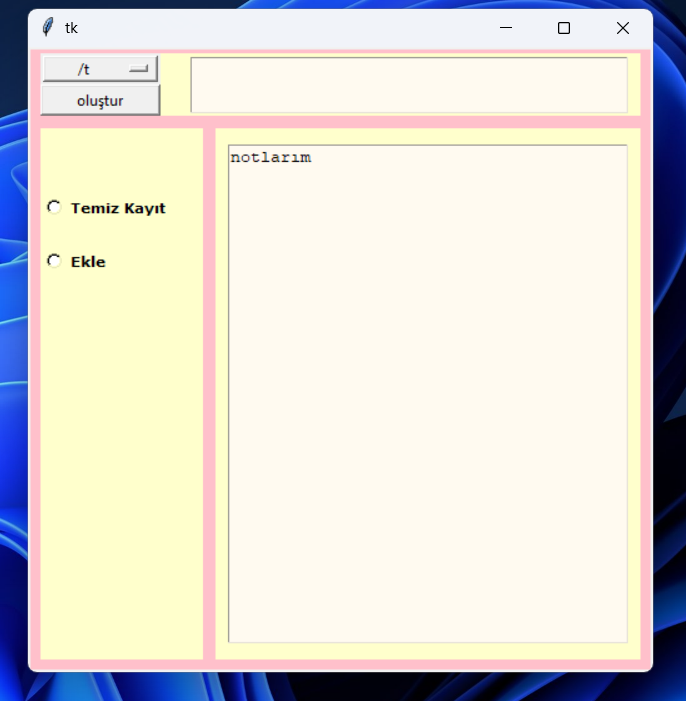

# NotePad Uygulaması

Python ve **Tkinter** kütüphanesi kullanılarak geliştirilmiş, minimalist ve kullanıcı dostu bir not defteri uygulaması. 

## Özellikler
* **Modern Arayüz:** Göze hitap eden pembe tema ve düzenli yerleşim.
* **Hızlı Kayıt:** Notlarınızı anında kaydedebilme özelliği.
* **Seçenekli Kayıt:** Verileri dosyaya ekleme (append) veya üzerine yazma (write) modları.
* **Özel İkon:** Projeye özel tasarlanmış uygulama simgesi.
* **Taşınabilirlik:** `.exe` formatı sayesinde Python yüklü olmayan bilgisayarlarda da çalışabilir.

## Kullanılan Teknolojiler
* **Python**: Ana programlama dili.
* **Tkinter**: Grafiksel arayüz (GUI) tasarımı.
* **PyInstaller**: Uygulamayı masaüstü yazılımına dönüştürme.
* **Pillow (PIL)**: İkon ve görsel işlemleri.

## Kurulum ve Çalıştırma
Uygulamayı çalıştırmak için iki seçeneğiniz var:
1. **Geliştiriciler için:** `main.py` dosyasını herhangi bir Python IDE'sinde (PyCharm, VS Code vb.) çalıştırın.
2. **Kullanıcılar için:** `dist` klasörü içindeki `.exe` dosyasını çift tıklayarak hemen kullanmaya başlayın.

## Ekran Görüntüsü
 

---
